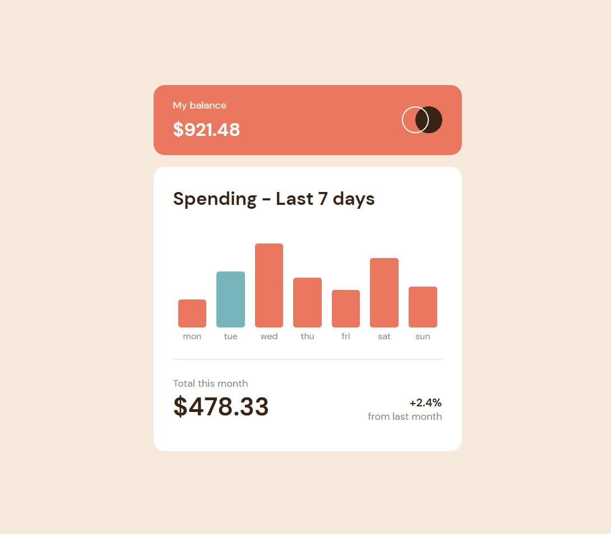

# Frontend Mentor - Expenses chart component

## Overview

The challenge is to build out this bar chart component and get it looking as close to the design as possible.

You can use any tools you like to help you complete the challenge. So if you've got something you'd like to practice, feel free to give it a go.

We provide the data for the chart in a local `data.json` file. So you can use that to dynamically add the bars if you choose.

Your users should be able to:

-  View the bar chart and hover over the individual bars to see the correct amounts for each day
-  See the current day's bar highlighted in a different colour to the other bars
-  View the optimal layout for the content depending on their device's screen size
-  See hover states for all interactive elements on the page
-  **Bonus**: See dynamically generated bars based on the data provided in the local JSON file

### Screenshot

### Links

-  Solution URL: [Solution URL here](https://www.frontendmentor.io/solutions/advice-generator-app-sasstypescript-IXC-M-enPg)
-  Live Site URL: [Live site URL here](https://genuine-kulfi-83e436.netlify.app/)

### Built with

-  Semantic HTML5 markup
-  CSS custom properties
-  Flexbox
-  Grid
-  Mobile-first workflow
-  [Typescript](https://www.typescriptlang.org/)
-  [Sass](https://sass-lang.com/)

### Useful resources

-  [Mozilla developers resources](https://developer.mozilla.org/)

## Author

-  Frontend Mentor [@malboyoo](https://www.frontendmentor.io/profile/malboyoo)
-  LinkedIn [Thibaut Lefevre](https://www.linkedin.com/in/thibaut-lefevre-b60101117/)
-  CodingGame [Malboyoo](https://www.codingame.com/profile/cb8f7ee433b9ee681c9b06a79c0669262406244)
